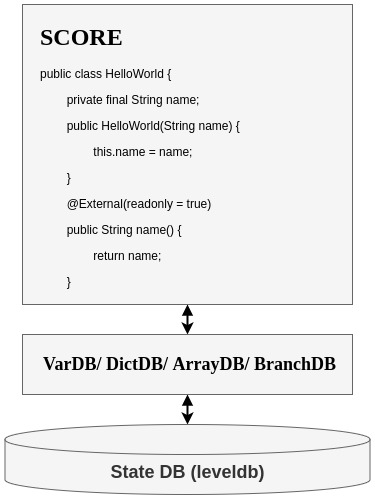

### ICON Smart Contract - SCORE

SCORE (Smart Contract on Reliable Environment) is a smart contract running on 
the ICON network. A smart contract is a collection of codes (functions) and data 
(states) that resides at a specific address on the blockchain. SCORE can be regarded 
as a state transition machine where a user could implement a service logic such as 
token transfers. The state transition is triggered by sending transactions to an 
address that the SCORE resides in. Any service logic that can be modeled by a state 
transition machine can be implemented in the SCORE code.The score contract can 
self-execute based on triggered events, and transactions are transparent and trackable

SCORE is initially deployed on the blockchain by sending a deploy transaction that holds
compressed binary data of the SCORE code. Once you deploy a SCORE on the ICON network 
successfully, the SCORE will get a new address that starts with 'cx'. After that, you 
can send a transaction to the address of SCORE. Unlike other blockchain systems, the 
deployed SCORE can be updated, and the corresponding SCORE address still remains the 
same even after the update.

SCORE must follow sandbox policy, i.e. some operations like file system access or 
network API calls are strictly prohibited. A transaction sent from a user will be
executed on every node that exists on the ICON network. And the nodes will form 
consensus on the transaction result. So deterministic behavior is very important aspect
when you write SCORE code, because every node should agree on the execution result. 
Therefore, you cannot use a random operation like using random() function, cannot make 
network calls that may get different results depending on the connection, cannot make 
system calls that results may also differ between nodes. Also, you cannot do 
long-running operations in SCORE, that may prevent forming consensus between nodes. 
These sandbox policies should be obeyed by every SCORE programmer.

### Limitations

- SCORE code size is limited to about 64 KB (actually bounded by the maximum step 
limit value during processing its deploy transaction) after being compressed. 
- The maximum count of inter-SCORE call or ICX transfer/send is 1024 in one transaction. 
- The maximum stack depth that a SCORE can call external functions recursively is 
64 in one transaction. 
- Declaring member variables which are not managed by the state DB is prohibited.

